#### JDK版本 : 1.8.0_312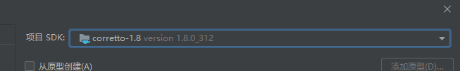

#### Tomcat : 8.5.71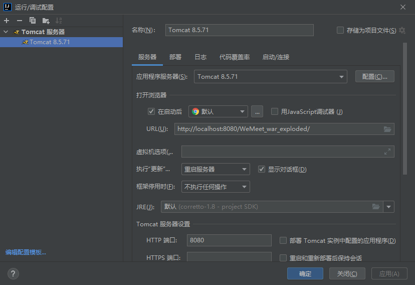

#### MySQL : 8.0.27

#### 大家不要删除我写的测试文件，在忘记流程的时候可以看一下测试文件。

#### 项目目录结构：
images 为README.md文档的图片
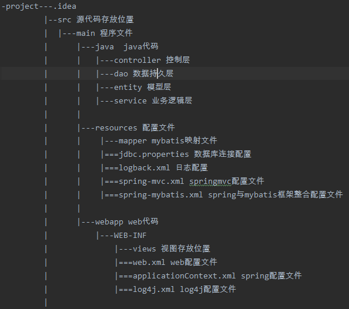

#### jdbc配置
在这里
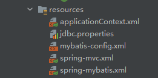


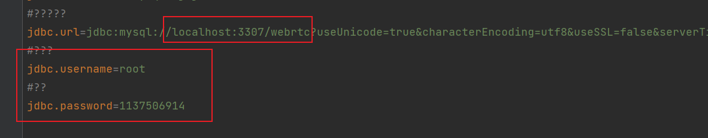
修改成自己的端口号（大家默认的都是3306）数据库名称
账号和密码
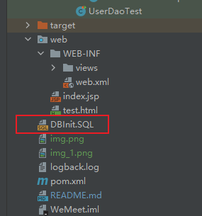

这是一份测试用的sql文件。大家先在自己的SQL里跑一下就行

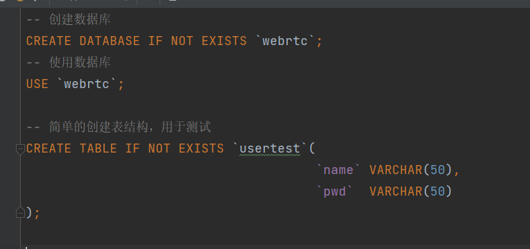

内容很简单 主要是为了测试


#### 默认文件作用（如果学的不好可以按照该顺序和说明无脑开发）
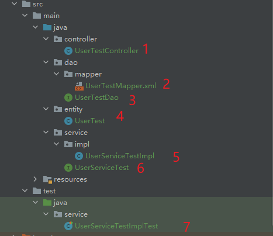

**自底向上顺序为4、2、3、6、5、7**

### entity（4）
该目录为常用对象目录，例如用户，管理员，房间号等对象都在此处声名
我们所有的操作都是对对象的操作，为符合Mybatis标准，此处类属性名应与数据库中字段名相同
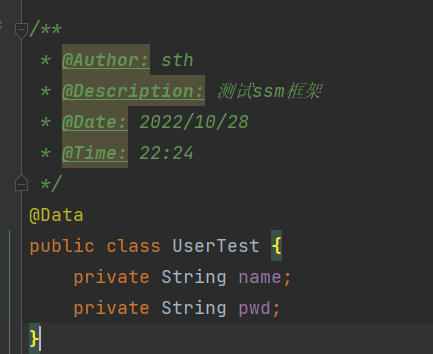

### dao（2、3）
该目录为持久层，主要作用是完成与数据库的交互将瞬时信息持久化（存入数据库）。
2文件为mybatis的映射文件（当然，如果学有所余可以使用mybatis的注释写SQL语句），
其主要作用是将sql语句存储在此，然后通过namespace固定接口（3），使接口可以调用该SQL语句

图例：
2文件
```xml
<mapper namespace="dao.UserTestDao">
    <select id="findAllUser" resultType="entity.UserTest" >
        SELECT * FROM usertest
    </select>
</mapper>
```
其中namespace是绑定的接口文件的位置，select语句中的id为接口文件名对应
```java
/**
 * @Author: sth
 * @Description: UserTest Dao层接口，用于将xml的sql代码交给spring处理
 * @Date: 2022/10/29
 * @Time: 13:07
 */
public interface UserTestDao {
    List<UserTest> findAllUser();
}
```
中的UserTestDao 和 findAllUser（）
**到了这里，我们就可以直接用实现了UserTestDao接口的类实例化（Spring中使用IOC自动装载）调用UserTestDao的findAll方法来执行sql语句

测试可见test里的UserDaoTest
```java
import dao.UserTestDao;
import entity.UserTest;
import org.junit.Test;
import org.junit.runner.RunWith;
import org.springframework.beans.factory.annotation.Autowired;
import org.springframework.test.context.ContextConfiguration;
import org.springframework.test.context.junit4.SpringJUnit4ClassRunner;

/**
 * @Author: sth
 * @Description: 用于测试Dao层作用
 * @Date: 2022/10/30
 * @Time: 15:38
 */
@RunWith(SpringJUnit4ClassRunner.class)
@ContextConfiguration("classpath:spring-mybatis.xml")
public class UserDaoTest {
    @Autowired
    private UserTestDao userTestDao;

    @Test
    public void myTest(){
        for (UserTest userTest : userTestDao.findAllUser()) {
            System.out.println(userTest);
        }
    }
}

```
至此Dao作用及用法讲解完毕

### service层(5、6文件)
该层主要由接口和实现类组成，疑问：这一层是干嘛的？

service层顾名思义是为了服务某一方的，我们可以在这一层再将下面那一层（Dao层）的东西抽象
比如说我们Dao层写了很多CURD（增删改查），这些CURD可能有user的也可能有admin的也可能由兴趣爱好或者房间号这些CURD
service层的目的就是将这些散着的CURD再次抽象。我们将user常用的操作全部写在一个UserService中，
这样在controller层我们对人进行的操作只需要实例化UserService这一个类，然后调用这个类方法就行。

文件6是UserService的接口，我们可以在这里声名各种需要用到的方法。
文件5是UserService的实现类，我们在这里实现文件6中的方法。实例化时我们使用的是实现类。

### controller层（基础JavaWeb中的servlet）


#### Spring中的Servlet与普通的Servlet不同
Spring对Servlet做出的优化是：
原先的JavaWeb我们每写一个servlet都需要创建一个继承了HttpServlet的类
并且需要在web.xml中声名。Spring使用了一个叫ServletDispatcher的东西。
顾名思义，他会对你的servlet进行分发。类似connect pool。

如图（web.xml）
```xml
    <servlet>
        <servlet-name>SpringMVC</servlet-name>
        <servlet-class>org.springframework.web.servlet.DispatcherServlet</servlet-class>
        <!-- 配置springMVC需要加载的配置文件-->
        <init-param>
            <param-name>contextConfigLocation</param-name>
            <param-value>classpath:spring-*.xml</param-value>
        </init-param>
        <load-on-startup>1</load-on-startup>
        <async-supported>true</async-supported>
    </servlet>
```
```xml
    <servlet-mapping>
        <servlet-name>SpringMVC</servlet-name>
        <!-- 匹配所有请求 -->
        <url-pattern>/</url-pattern>
    </servlet-mapping>
```
我们只在web.xml中配置了一个servlet便可完成所有servlet。原因是，配置的这一个servlet是一个连接池。
我们所有的请求都会先接入到这个servlet中然后再由他dispatch给真正的servlet。

#### 如何编写真正的servlet？
我们只需在controller文件下创建类即可
再将类名上注解

示例：
```java
/**
 * @Author: sth
 * @Description: 用于UserTestController测试
 * @Date: 2022/10/29
 * @Time: 15:53
 */
@Controller //标记为MVC的控制器类，方便DispatcherServlet进行扫描定位
@RequestMapping("/test")
public class UserTestController {
    @Resource
    private UserServiceTest userServiceTest;

    @RequestMapping("/findAll")
    @ResponseBody
    public List<UserTest> findAll(){
        return userServiceTest.findAllUser();
    }


}
```
其中类名上的注解为这个servlet的总地址
方法名上的注解为servlet的子地址

如此处我想访问findAll接口就需要访问总地址/子地址
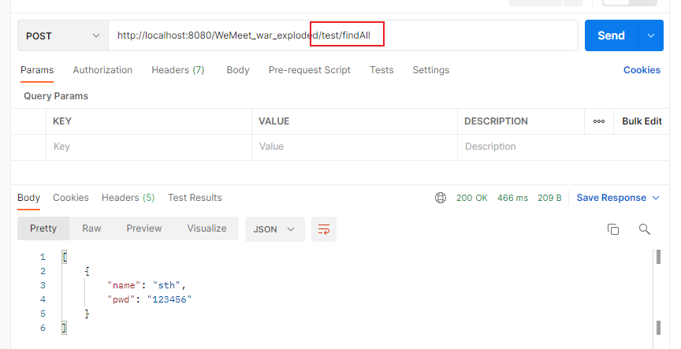

我们可以在一个类名下创建多个servlet
例如:
```java
package controller;

import entity.UserTest;
import org.springframework.stereotype.Controller;
import org.springframework.web.bind.annotation.RequestMapping;
import org.springframework.web.bind.annotation.ResponseBody;
import service.UserServiceTest;

import javax.annotation.Resource;
import java.util.List;

/**
 * @Author: sth
 * @Description: 用于UserTestController测试
 * @Date: 2022/10/29
 * @Time: 15:53
 */
@Controller //标记为MVC的控制器类，方便DispatcherServlet进行扫描定位
@RequestMapping("/test")
public class UserTestController {
    @Resource
    private UserServiceTest userServiceTest;

    @RequestMapping("/findAll")
    @ResponseBody
    public List<UserTest> findAll(){
        return userServiceTest.findAllUser();
    }


//多个servlet
    @RequestMapping("/findAll1")
    @ResponseBody
    public List<UserTest> findAll1(){
        return userServiceTest.findAllUser();
    }


    @RequestMapping("/findAll2")
    @ResponseBody
    public List<UserTest> findAll2(){
        return userServiceTest.findAllUser();
    }


}

```
其中 我们都可以用子地址访问到新的servlet
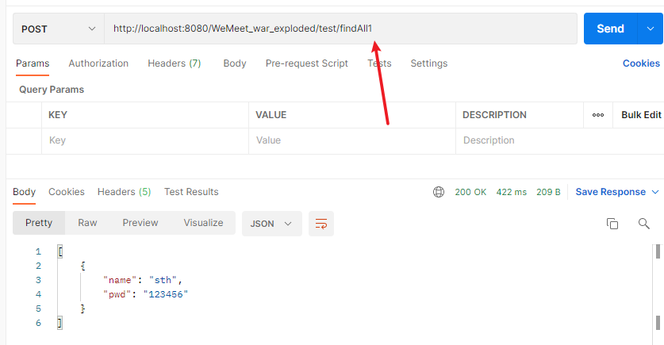

### test
该包为测试文件包，我们可以用Spring提供的测试工具单元测试某个模块，
留下的默认文件中我使用了UserTestServiceImpl测试了User用户的查询所有用户功能。

### linux部署coturn
turnserver -v -r xxx.xxx.xxx.xxx(公网ip):3478 -a -o -c turnserver.conf

## 至此对目录及其作用的简要讲解完毕。


